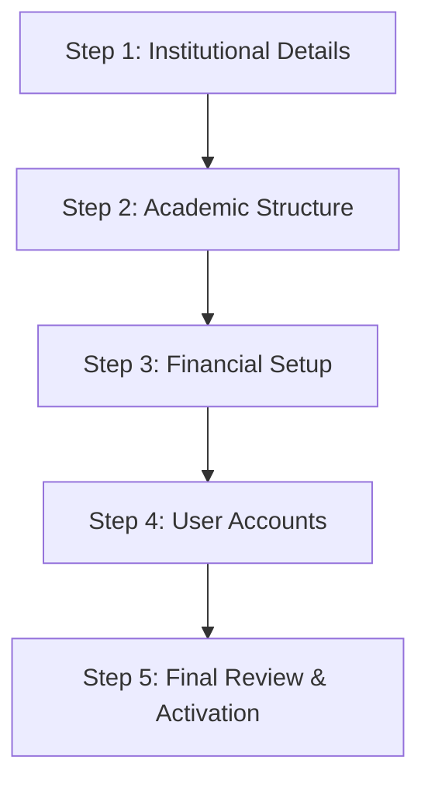
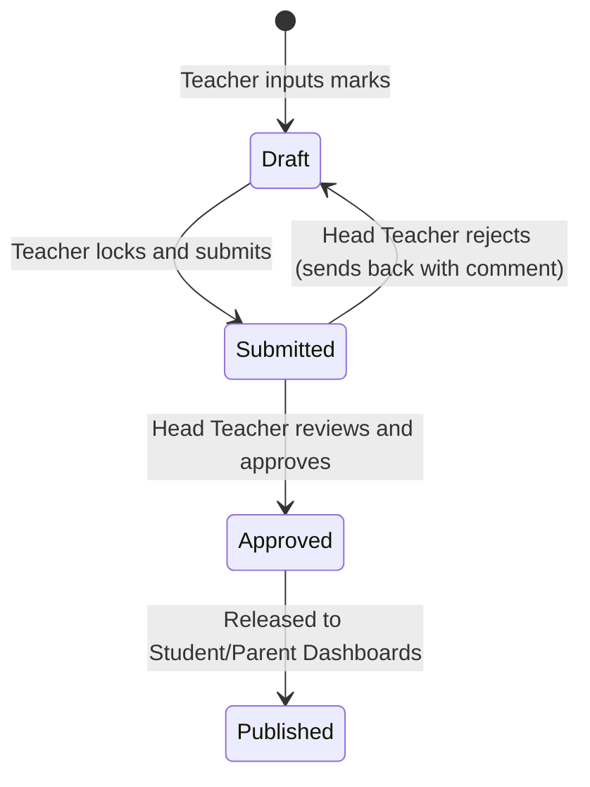

# MyKlasi SMS: Complete System & Training Guide
## Welcome to the School Management System (SMS)

This document is a comprehensive guide to **MyKlasi SMS** (Tenpaten-SMS), designed to help school directors, administrators, teachers, bursars, IT staff, students, and parents understand how the platform works. It serves as both a training manual for onboarding new staff and a functional reference for advanced workflows.

---

## 1. Product Overview & Design Philosophy

MyKlasi SMS is a multi-tenant school management system tailored specifically for educational institutions in sub-Saharan Africa. The system's design addresses local realities: high ambient light (outdoor usage), diverse mobile devices (from low-end smartphones to high-end laptops), and variable internet connectivity.

### Visual Design System
*   **Aesthetics:** Utilitarian-premium. The interface is clean, professional, and built on an **8px linear grid system**.
*   **Palette:** Slate-neutral palette with high-contrast elements. 
    *   **Primary Green (#0e7a3f):** Symbolizes growth, academic progression, and authority. Used for structural borders, navigation bars, and primary buttons.
    *   **Secondary Gold (#ffd000):** Symbolizes achievement, opportunity, and positive financial actions (e.g., "Pay Fees").
    *   **Tonal Layering:** The primary background uses Slate White (`#F8FAFC`). Core card elements use pure White (`#FFFFFF`) with thin `1px` Slate borders (`#E2E8F0`) instead of heavy dropshadows, ensuring readability even on low-cost screens or when printed.
*   **Typography:** Geometric **Outfit** for headlines (modern and readable at a glance) and **Inter** for data grids, forms, and report sheets (clean, low-contrast, and highly legible).
*   **Touch Targets:** All interactive buttons and inputs have a minimum size of `48px` to facilitate mobile usability.

---

## 2. Platform Access & Security Architecture

MyKlasi SMS enforces strict tenant isolation and role-based access control (RBAC). A user accounts' credentials, sessions, and roles are tied specifically to their school tenant.

### Security Controls
1.  **Account Lockouts:** To prevent brute-force attacks, accounts are temporarily locked for a duration (`lockedUntil`) after 5 consecutive failed login attempts (`failedLoginAttempts`).
2.  **Forced Password Reset (`mustChangePassword`):** When administrators generate accounts for staff, users are prompted to change their temporary passwords immediately upon their first login.
3.  **Token Rotation & Session Revocation:** Refresh tokens are hashed using SHA-256 and tracked inside a token family. If a token is reused (indicating a potential hijack/session theft), the system detects the anomaly, invalidates the entire family chain, and forces re-authentication.
4.  **Security Auditing:** A tamper-evident `AuditLog` records crucial platform events:
    *   `LOGIN_SUCCESS` / `LOGIN_FAILED`
    *   `PASSWORD_RESET`
    *   `ACCOUNT_LOCKED`
    *   `TOKEN_REVOKED`
    *   IP Address & User-Agent capture for security forensics.

---

## 3. The 10 User Roles: Operations & Permission Matrix

The application handles permissions dynamically through 10 distinct roles. Below is the operational matrix showing what each user role is designed to do:

| Role | Access Level / Focus | Key Activities & Screens |
| :--- | :--- | :--- |
| **Super Admin** | Platform Owner / Multi-Tenant Admin | Manages schools, subscriptions, platform billing, global user lists, platform health analytics, support tickets, system-wide broadcasts, and audit logs. |
| **Director** | School System Owner (Multi-School or Franchise) | High-level read access across school academic progress, unified financial reporting, staff rosters, and multi-school settings. |
| **School Director** | Individual School Owner | Accesses high-level reports (financial collections, enrollment numbers, academic rankings, teacher performance), and settings. |
| **IT Coordinator** | Systems Admin & Setup | Manages physical infrastructure (rooms), timetabling parameters, user account creation, credentials, lockouts, and system configuration. |
| **Head Teacher** | Academic & Operational Lead | Unified dashboard to oversee all classes, approve grades, publish reports, configure terms, and manage the student/staff directory. |
| **Deputy Head** | Student Affairs & Discipline | Manages day-to-day discipline logs, student files, staff rosters, attendance logs, timetable conflicts, and overrides. |
| **Teacher** | Classroom & Subject Lead | Marks student attendance (morning/period), configures assessment weightings, enters continuous assessment (CA) and exam grades. |
| **Bursar** | Financial Officer | Defines termly class fee structures, registers payments, tracks invoices, manages outstanding balances, and issues receipts. |
| **Student** | Learner / Consumer | Views their report cards, active timetables, homework assignments, attendance histories, and invoice statements. |
| **Parent** | Guardian | Monitors linked children: reviews balances due, processes payment entries, examines daily attendance, and reads report cards. |

---

## 4. Step-by-Step Core Workflows

### Workflow A: School Onboarding & the Setup Wizard

When a school first joins the platform, the **School Setup Wizard** walks the school administration through five essential steps to initialize their workspace:



1.  **Step 1: Institutional Details:** 
    *   Enter the official School Name, Motto, Address, District (supports Malawi's 28 districts), and contact details (Phone/Email).
    *   Create a unique **School Code** (e.g., `MKL-001`). This code is used by all staff, students, and parents to log in.
2.  **Step 2: Academic Structure:**
    *   Define the academic system (term-based vs. semester-based).
    *   Set the number of terms per year (default: 3).
    *   Add available grade levels (e.g., Grade 1 to 8, or Form 1 to 4) and section streams (e.g., A, B, Blue, Green).
    *   Provide a list of subjects (e.g., Mathematics, English, Chichewa, Agriculture).
3.  **Step 3: Financial Setup:**
    *   Choose the operating currency (default: `MWK` - Malawian Kwacha).
    *   Input default termly fees for primary and secondary grade groups.
    *   Configure late payment penalty rules and allowed payment methods (Cash, Bank Transfer, Mobile Money).
4.  **Step 4: User Accounts:**
    *   Create initial accounts for the key administrators (Head Teacher, Bursar, IT Coordinator) by entering their names and emails.
5.  **Step 5: Final Review:**
    *   Verify all configurations. Upon submission, the database generates the initial tenant structure, completing the setup.

---

### Workflow B: Academic Infrastructure & Timetabling

Setting up the school calendar, classes, and rooms is required before teachers can take attendance or record grades.

#### 1. Academic Calendar
Administrators create an `AcademicYear` (e.g., "2026 Academic Year") and divide it into `Term` intervals. Only **one** academic year and **one** term can be flagged as `isCurrent: true`.

#### 2. Infrastructure Setup (Rooms & Classes)
*   **Rooms:** IT Coordinators create rooms in the system (e.g., "Science Lab", "Form 1A Classroom") with designated seating capacities.
*   **Classes:** Under `classes`, administrators define sections by attaching them to an Academic Year and mapping them to a physical Room (e.g., Form 1 Stream A in Room 1).
*   **Subjects:** Subjects are set up with custom properties:
    *   `isCore` flag (determines if it is compulsory for all students in a grade level).
    *   `caMax` (Continuous Assessment maximum weight, e.g., 30%).
    *   `examMax` (Final Exam maximum weight, e.g., 70%).
    *   `gradingScaleId` (links the subject to a custom letter grading scale).

#### 3. Class-Subject-Teacher Assignments
To give teachers access to their classrooms, administrators must create a `ClassSubject` assignment mapping:
$$\text{Class} + \text{Subject} \longrightarrow \text{Teacher}$$
*Example: Form 1A + Mathematics $\longrightarrow$ Mr. Blessings Muyeya.*

#### 4. Timetable Allocation
The IT Coordinator maps `TimetableSlot` records to structure the school day.
*   A slot is defined by `classId`, `day` (Mon-Fri), `periodNumber` (e.g., Period 1, 2, 3), and `termId`.
*   The system checks for clashes: A teacher or a room cannot be assigned to two different slots at the same time.

---

### Workflow C: Student & Parent Enrollment

1.  **Student Profiles:** 
    *   Each student must have a profile (`StudentProfile`) containing their unique **Admission Number**, Date of Birth, Gender, Enrollment Date, and Boarding Status (`day` or `boarding`).
    *   Students are assigned to an active Class.
    *   Their account status defaults to `active` but can be updated to `suspended_fees`, `suspended_discipline`, `graduated`, or `withdrawn`.
2.  **Parent-Student Relations:**
    *   Parents are registered as separate users (`UserRole: parent`).
    *   A link is established in the `ParentStudent` table mapping a parent to one or multiple students, allowing them to view aggregated child records.

---

### Workflow D: Attendance Tracking & Overrides

MyKlasi SMS supports two attendance strategies configured at the school level: **Morning Attendance** (taken once daily) and **Period Attendance** (taken during individual subject blocks).

```
[Teacher Dashboard] 
    └── Click "Mark Attendance"
         └── Cycle Student Status: Present (Green) ──> Absent (Red) ──> Late (Yellow)
              └── Input Optional Reason (e.g., "Doctor Appointment")
                   └── Save and Lock
```

#### Override Auditing
If an attendance status needs adjustment (e.g., an absent student arrives late with an excuse), the **Deputy Head** or **Head Teacher** can perform an override.
*   The system creates an `AttendanceOverride` record.
*   This audit log stores the `oldStatus`, `newStatus`, the `reason` for the change, and the name of the administrator who performed the override.

---

### Workflow E: Grading & Report Cards Lifecycle

Grading follows a strict security lifecycle to prevent unauthorized grade manipulation.



1.  **Step 1: Grade Entry (Draft)**
    *   The subject teacher opens their dashboard, selects the subject and class, and inputs the CA Mark (out of the subject's max, e.g., 30) and Exam Mark (out of max, e.g., 70).
    *   The system automatically calculates the `totalMark` (CA + Exam) and queries the active `GradingScale` to assign the correct `gradeLetter` (e.g., A, B, C, F).
2.  **Step 2: Submission**
    *   The teacher locks the grades and submits them (`submissionStatus: submitted`). At this point, the teacher can no longer edit the marks.
3.  **Step 3: Administrative Approval**
    *   The Head Teacher or Deputy Head reviews the submitted class marksheet.
    *   **Approve:** The administrator signs off (`submissionStatus: approved`).
    *   **Reject:** The administrator rejects the grades, providing a `rejectionComment`. This returns the class grades to a `draft` state, allowing the teacher to make corrections.
4.  **Step 4: Publishing**
    *   Once approved, the administrator publishes the grades. The grades are marked as `isPublished: true` and immediately become visible to parents and students on their dashboards.

---

### Workflow F: Finance & Fee Collections

The finance module manages school revenue and monitors student arrears.

#### 1. Defining Fee Structures
Bursars create a `FeeStructure` mapping for each class and term. A structure divides fees into:
*   **Tuition Fee:** The core academic fee.
*   **Boarding Fee:** Charged only to students registered as `boarding` under their boarding status.
*   **Other Fees:** Development funds, sports fees, or exam fees.
*   *Total Amount* is calculated dynamically based on the student's profile.

#### 2. Invoice Generation
At the beginning of each term, the system generates an `Invoice` for every active student based on the class fee structure and their boarding status.
$$\text{Amount Billed} = \text{Tuition Fee} + \text{Other Fee} + (\text{Boarding Fee, if boarding})$$
$$\text{Balance} = \text{Amount Billed} - \text{Amount Paid}$$

#### 3. Recording Payments & Generating Receipts
When a payment is received, the Bursar navigates to the **Payments** interface:
*   Select the student's invoice.
*   Enter the payment details: `amount`, `paymentMethod` (cash, bank, mobile_money, cheque), and an optional `referenceNumber` (such as bank transaction ID).
*   The system generates a unique **Receipt Number** (monotonically tracked per school) and updates the invoice:
    *   `amountPaid` is incremented.
    *   `balance` is updated.
    *   If the balance reaches zero, the status shifts to `paid` (otherwise, it remains `partially_paid`).
*   Bursars can generate printable receipt slips directly from the browser.

---

## 5. Offline Functionality & PWA Support

To ensure usability in environments with unstable internet connections, MyKlasi SMS operates as a **Progressive Web App (PWA)** with offline synchronization.

### 1. Offline Mode Capabilities
*   **Client Cache:** The application uses a service worker to cache static assets, stylesheets, scripts, and fonts.
*   **IndexedDB Sync:** The PWA stores recent student directories, timetable schedules, and drafts of attendance logs locally in the browser's storage database (IndexedDB).
*   **Offline Indicator Banner:** If the connection drops, a yellow warning bar appears at the top of the interface: *"You are currently offline. Actions will be saved locally and synchronized when your connection is restored."*
*   **Reconnection Sync:** When network connectivity is restored, the service worker background sync pushes queued local attendance logs and drafts to the API server, ensuring no data loss.

### 2. How to Install the PWA
*   **On Android (Chrome/Edge):** Open the school site URL. A banner saying *"Add MyKlasi to Home screen"* will prompt the user. Tap to install. It will appear on the app drawer as a native application.
*   **On iOS (Safari):** Open the site in Safari. Tap the **Share** button, scroll down, and select **"Add to Home Screen"**.
*   **On Desktop:** Click the installation icon (a monitor with a download arrow) directly on the browser's address bar to install the app as a desktop application.

---

## 6. Role-Specific Dashboards & Quick Navigation Reference

Below is a reference guide for each dashboard, highlighting the primary actions and where to find them:

### A. Head Teacher Dashboard
*   **Home View:** School-wide enrollment counter, average attendance rates, pending grade submissions alert panel.
*   **Academic Tab:** Approve/reject class marksheets, configure global grading scales.
*   **Timetable Tab:** View the master timetable for all classes and teachers.
*   **People Tab:** Register new students, edit staff profiles, modify roles.

### B. Teacher Dashboard
*   **Home View:** Quick links for marking attendance, today's teaching schedule, and grade entry shortcuts.
*   **Classes Tab:** Access the list of students in assigned classes.
*   **Attendance Tab:** Mark daily attendance. You can tap status badges to cycle between **Present** (Green), **Absent** (Red), and **Late** (Yellow).
*   **Grades Tab:** View assignments, input grades, and submit marksheets.

### C. Deputy Head Dashboard
*   **Home View:** Quick widgets for active disciplinary issues, daily attendance charts.
*   **Discipline Tab:** Log behavioral incidents, disciplinary measures, and parent-teacher meeting requests.
*   **Attendance Tab:** View student attendance logs and apply overrides for excused absences.

### D. Bursar Dashboard
*   **Home View:** Collection rate progress bar, cashflow counters (Total Invoiced vs. Total Collected), payment methods breakdown chart.
*   **Fees Tab:** Configure the fee structure for each class level.
*   **Payments Tab:** Record new payments and search payment histories.
*   **Students Tab:** Search student invoice balances and issue statements of accounts.

### E. IT Coordinator Dashboard
*   **Home View:** Server connection indicator, quick counters of rooms and active users.
*   **Users Tab:** Manage logins, reset passwords, and unlock accounts.
*   **Infrastructure Tab:** Create rooms, assign capacities, and set daily period structures (e.g., number of periods, break times).

### F. School Director Dashboard
*   **Home View:** Overall financial collection rate, total revenue summaries, monthly attendance averages, and academic ranking reports.
*   **Reports Tab:** Download PDF summaries of terminal accounts, fees audits, and teacher performance records.

### G. Parent Dashboard
*   **Home View:** Linked children selection cards.
*   **Child Overview:** Fee balance due, child's daily attendance records, and child's terminal report cards.

### H. Student Dashboard
*   **Home View:** Personal class timetable, homework/assignments due, current term attendance summary, and published report cards.
